# Capstone Project - DSI Cohort 7 - DS Team 6

## Analyzing TTC Data on Streetcar Delays in 2024
For our capstone project in the Data Sciences Certificate program at the University of Toronto’s Data Sciences Institute, we set out to explore real-world questions using the 2024 dataset on Toronto Transit Commission's (TTC) streetcar delays.

## Project Sections
[Purpose and Overview](https://github.com/namathew7/ds6/blob/main/README.md#purpose-and-overview) \
[Project Scope](https://github.com/namathew7/ds6/blob/main/README.md#project-scope) \
[Methodology](https://github.com/namathew7/ds6/blob/main/README.md#methodology)\
[Data Cleaning](https://github.com/namathew7/ds6/blob/main/README.md#data-cleaning)\
[Insights from Data Visualization](https://github.com/namathew7/ds6/blob/main/README.md#insights-from-data-visualization)\
[Regression and Classification Modeling](https://github.com/namathew7/ds6/blob/main/README.md#regression-and-classification-modeling) \
[Conclusions](https://github.com/namathew7/ds6/blob/main/README.md#conclusions) \
[Limitations](https://github.com/namathew7/ds6/blob/main/README.md#limitations) \
[Ideas for Future Analyses](https://github.com/namathew7/ds6/blob/main/README.md#ideas-for-future-analyses-things-we-would-have-done-if-we-had-more-time) \
[Team Videos](https://github.com/namathew7/ds6/blob/main/README.md#team-videos)\
[Credits and Sources](https://github.com/namathew7/ds6/blob/main/README.md#credits-and-source) 

## Purpose and Overview

The goal of this project is to analyze and visualize trends in TTC streetcar delays using the 2024 dataset. We will investigate if it is possible to correlate delay time with traits such as incident, bound direction, vehicle number, time of day, date, and streetcar line. The project aims to give TTC staff a better understanding of the factors that contribute to delay time, so that they can mitigate delays accordingly.

## Project Scope
This project involves conducting analyses on TTC streetcar delay data to characterize delay times based on key factors such as incident, bound direction, and time of day.
The resulting model could be valuable for: Communicating approximate delay times to the public through various channels (e.g., apps, website, etc.) and Assisting in resource deployment by estimating the expected duration of delays (e.g., longer delays may require greater urgency and more staff).
The analysis will be validated through data splitting and performance metrics to ensure reliability. Additionally, the project will include insights and recommendations on the situations most likely to cause the longest delays. These insights could also inform HR planning by identifying patterns that impact staffing needs.

### Stakeholders

1. TTC Operations, Planning, and Data Team: Build predictive models and use the insights to optimize streetcar schedules.
2. TTC Communications Team: Use insights to communicate accurate delay information.
3. TTC Human Resources Team: Apply findings to staffing and hiring decisions.
4. TTC Business Strategy & Insights Team: Leverage results to inform new route planning or network design.
5. TTC Users: Knowledge of factors likely to cause delays, which can help them plan their commutes.

## Methodology
### Steps Taken:
- Data acquisition:  
    - Primary Dataset: TTC Streetcar Delay Data was obtained from the [City of Toronto’s Open Data Portal – TTC Streetcar Delay Data](https://open.toronto.ca/dataset/ttc-streetcar-delay-data/)
    - Weather Data: Historical weather information was sourced from [Environment and Climate Change Canada (ECCC) using Station ID 6158355](https://climate.weather.gc.ca/historical_data/search_historic_data_e.html)
    - TTC stops and Street Car routes were obtained from City of Toronto Map Portal
- Data cleaning: Manually corrected spelling and formatting mistakes in the "Location" column, removed rows that were not part of the established TTC streetcar routes, and removed rows that contained missing values in the `Bound` column.
- Exploratory Analysis: Used visualization techniques to understand patterns and find correlations between different variables.
- Regression Analysis and Cross-Validation: Built various regression models and pipelines (KNN, Linear, XGBoost, Ridge, Lasso, Random Forest) to determine minutes of delay, created training and testing sets, and assessed model accuracy.
- Classification: Built a classification model using Random Forest, to classify delays as either ‘minor’ or ‘moderate’. Created training and testing sets, used cross-validation and classification reports to assess model precision and recall.
- Visualization: Created bar plots, line plots, and heatmaps to represent insight and model results.
- Recommendations for the TTC
- Conclusions

### Technical Stack:

**Programming Languages:**
Python

**Python Libraries Used:**
- Numpy: matrix operations
- Pandas: data analysis
- Glob: bulk csv import (weather data)
- Matplotlib: creating graphs and plots
- Seaborn: enhancing matplotlib plots
- Scikit Learn: regression analysis, classification analysis, cross-validation, preprocessing, pipeline workflows, metrics
- XGBoost: regression analysis

**Other Software:** 
Excel, Geographic Information Systems (ArcMap)

### Describing the Dataset

We used TTC streetcar delay data from Toronto’s open data catalogue for the 2024 year. While data for other years is available, we chose to use the 2024 dataset as it is a large sample (~14,000 rows) and it’s the most recent, complete year of data.

### Understanding the Features
| Column Name | Description                                      |
|-------------|--------------------------------------------------|
| Date        | Incident date (MM/DD/YYYY)                       |
| Line        | Streetcar route number                           |
| Time        | Time of day (24h clock)                          |
| Day         | Day of the week                                  |
| Location    | Location of incident (intersection/ street)      |
| Incident    | Type of incident                                 |
| Min Delay   | Minutes of delay to streetcar service            |
| Min Gap     | Minutes between streetcars                       |
| Bound       | The direction of the streetcar travel            |
| Vehicle     | Streetcar vehicle number                         |

## Data Cleaning

Upon preliminary inspection, several inconsistencies were observed in the `Location` column and there was wide variety in how the same locations were reported.  Examples include different versions of the same intersection (ex. “Yonge and Dundas” vs. “Dundas and Yonge”), misspellings (I can never spell “Roncesvalles” correctly, either), typos (“Bathust” vs. “Bathurst”), punctuation (“St. Clair” vs “St Clair”),  abbreviations (“DVP” vs. “Don Valley Parkway”), and different ways to describe the same street (ex. “Queen”, “Queen Street”, “Queen Street West”, “Queen St”, “Queen Street W”, etc.).  Given the diversity of these errors, it was deemed important to manually clean the original excel file.  Location names were processed through Excel’s spellcheck feature, and manually screened for issues with typos, punctuation, and naming inconsistencies.  This manual process reduced the number of unique locations from 2104 to 1573.  The excel file containing manually-cleaned location data is made available as  “ttc-streetcar-delay-data-2024_location_cleaning.xlsx”.  Given how variable the errors in `Location` were, it was very difficult to try and use a code-based cleaning method.  It is likely that the manual cleaning introduced irreproducibility, unintentional errors, and/or accidental misassignments.  To ensure quality location data in future years, we highly encourage the TTC to standardize the way they record location information.

After cleaning the `Location` data, the data were further cleaned in Excel to eliminate data not associated with one of the established TTC streetcar routes defined online: https://www.ttc.ca/routes-and-schedules/listroutes/streetcar.  Rows of data where the “Line” column did not match one of these lines were simply deleted.  For the `Bound` column, all data were supposed to be either blank or a cardinal direction (`N`, `S`, `E`, or `W`).  Entries not in one of these categories were removed from the dataset (7 rows). All columns were checked for null values, and it was found that only the “Bound” column contained null values. Since it was not possible to use imputation for this type of value, or remove them from the dataset entirely (1971 rows were null), we kept these rows as-is. Finally, we checked that each column had the expected data type, and no errors were found.

The following table describes the unique values in each column, before and after cleaning:

| Column Name | Unique Values Before Cleaning | Unique Values After Cleaning |
|-------------|-------------------------------|------------------------------|
| Date        | 366                           | 366                          |
| Line        | 42                            | 18                           |
| Time        | 1438                          | 1438                         |
| Day         | 7                             | 7                            |
| Location    | 2104                          | 1573                         |
| Incident    | 13                            | 13                           |
| Min Delay   | 228                           | 227                          |
| Min Gap     | 239                           | 238                          |
| Bound       | 7                             | 5                            |
| Vehicle     | 1176                          | 1151                         |

### Enhancing the Data

As part of enhancing the data, several new columns were introduced: `Month`, `Week`, `Day of Month`, `Hour of Day`, and `Season`.  These columns are designed to further examine whether data on time of day or time of year and help predict length of delay or time of incident.  The resulting excel file is made available as [`ttc-streetcar-delay-data-2024_cleaned.xlsx`](https://github.com/namathew7/ds6/blob/main/Excel_Files/ttc-streetcar-delay-data-2024_cleaned.xlsx) and was used as the basis for all exploratory data analyses.

Weather was identified as a potential variable that could contribute to streetcar delays. This hourly data was sourced from [Environment Canada’s historical weather data Station 6158355](https://climate.weather.gc.ca/historical_data/search_historic_data_e.html). One csv file was available for each month of 2024 and the files were merged into one dataframe using the pandas library. The columns that were used are Date/Time (LST), Temperature(°C) and Precipitation (mm). We used the Date/ Time column to merge the weather dataframe with the TTC delays dataframe.

## Insights from Data Visualization

**Chart 1: Distribution of Delay Durations** 

*The most frequent duration of delays were found to be in the range of 11-15 minutes*

The vast majority of delay incidents fall within the shorter time ranges, with delays between 11–15 minutes being the most common at 5,408 incidents. This is followed by the 0–5 minute range with 2,868 incidents and the 6–10 minute range with 2,369 incidents, indicating that more than three-quarters of all delays occur within the first 15 minutes. After this point, the frequency of delays drops sharply: the 16–20 minute and 21–30 minute ranges show 682 and 977 incidents respectively, and the 31–45 minute range has 711 incidents. Longer delays are relatively rare, with only 301 incidents in the 46–60 minute range, 320 in the 61–90 minute range, 112 in the 91–120 minute range, and 182 incidents lasting 120 minutes or more. Overall, the data suggests that while long delays do occur, they make up a small portion of total incidents, and efforts to improve performance would be most impactful if focused on reducing the short but highly frequent delays—particularly those in the 11–15 minute range, where the highest concentration of issues is observed.

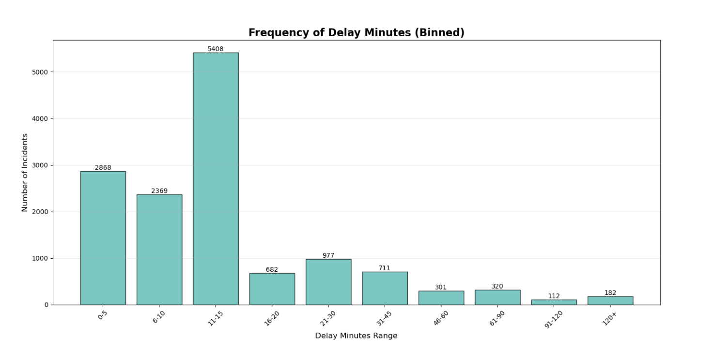

**Chart 2: Distribution of Minute Delay by Incident Type (Box Plot)** 

Most incident types—such as cleaning, unsanitary conditions, mechanical issues, and security-related events—tend to produce shorter and more consistent delays, with relatively low medians and tight interquartile ranges. In contrast, several types display significantly higher variability and longer potential delays. Incidents related to operations stand out with the widest spread and the highest upper range, indicating that they can lead to severe delays far exceeding those of other categories. Collisions involving the TTC, emergency services, and overhead issues also show larger dispersions, suggesting a greater likelihood of prolonged disruptions. Meanwhile, categories such as diversions, held-by incidents, and rail/switch issues produce moderate delays with some variability but fewer extreme outliers. While many everyday incidents result in predictable, shorter delays (e.g., investigations, mechanical, operations, etc.), specific event types—particularly overhead, diversion, and collisions—are responsible for the longest and most unpredictable service interruptions. The distribution of the data is skewed, as the mean of the dataset is 16 minutes and the median is 10 minutes, suggesting that the mean is highly influenced by outliers. Using average values for analysis would not represent the center of the data.

**Chart 3: Typical Delay Lengths per Incident** 

Diversions and overhead incidents were found to have the greatest average delay time per incident. However, it is important to note that there is a much smaller sample size for overhead incidents.

Most incident types fall within a moderate delay range—generally between 8 and 15 minutes—including cleaning/unsanitary issues, diversion, general delay, mechanical incidents, investigation, operational events, security, and “utilized off route” cases. A few categories, however, stand out for causing substantially higher average delays. Collisions involving the TTC produce an average delay of about 23 minutes, while diversions create even longer delays at roughly 44 minutes. The most significant contributor to extended service disruptions is overhead-related incidents, with the highest average delay at approximately 50 minutes. These values indicate that while many everyday incident types result in relatively short delays, a small number of high-severity categories—particularly overhead issues, collisions, and diversions—drive the longest average disruptions and have the greatest operational impact.

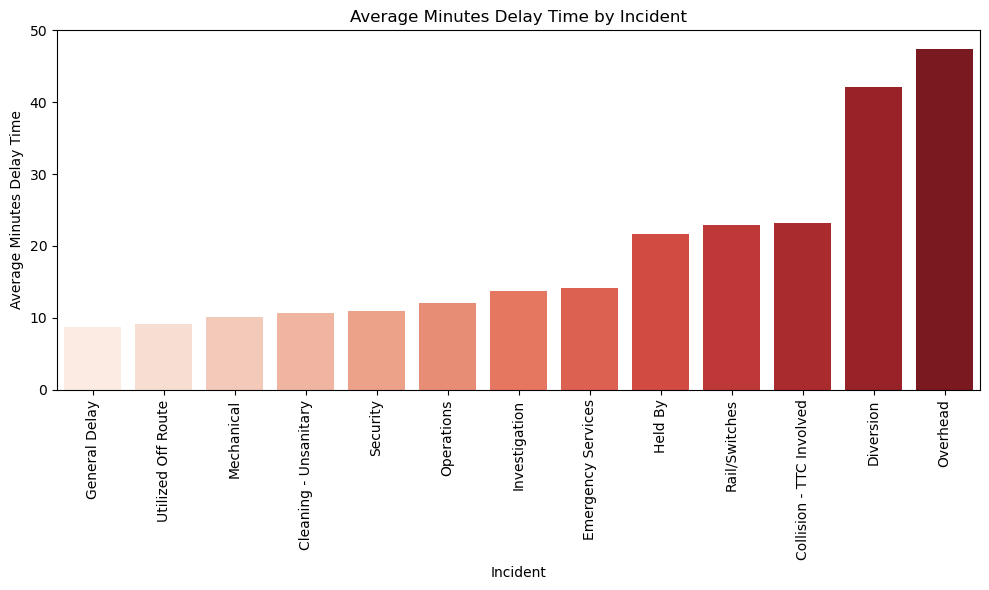

**Charts 4 and 5: Temporal Patterns** 

Temporal patterns are important to understand as they can indicate important variables (hour, day, week, month, season). When looking at the time series data, there were no obvious monthly trends. Total minutes delayed by season was higher in the summer and winter than the fall and spring. In the summer, this is largely due to operations delays and in the winter, these delays could be due to weather. Fall was the season with the lowest frequency of delays. Operations delays peaked on Saturdays, which is often when the TTC has service disruptions. In the hourly data, there were peaks during the morning and evening rush hours, as expected. 

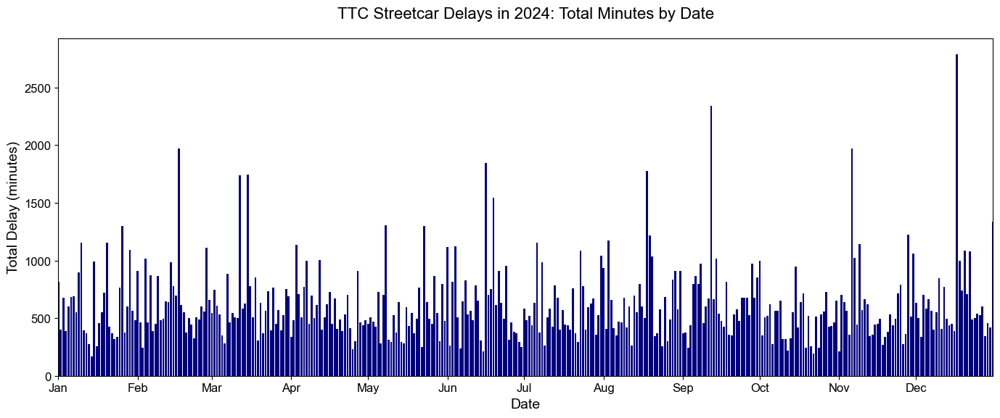
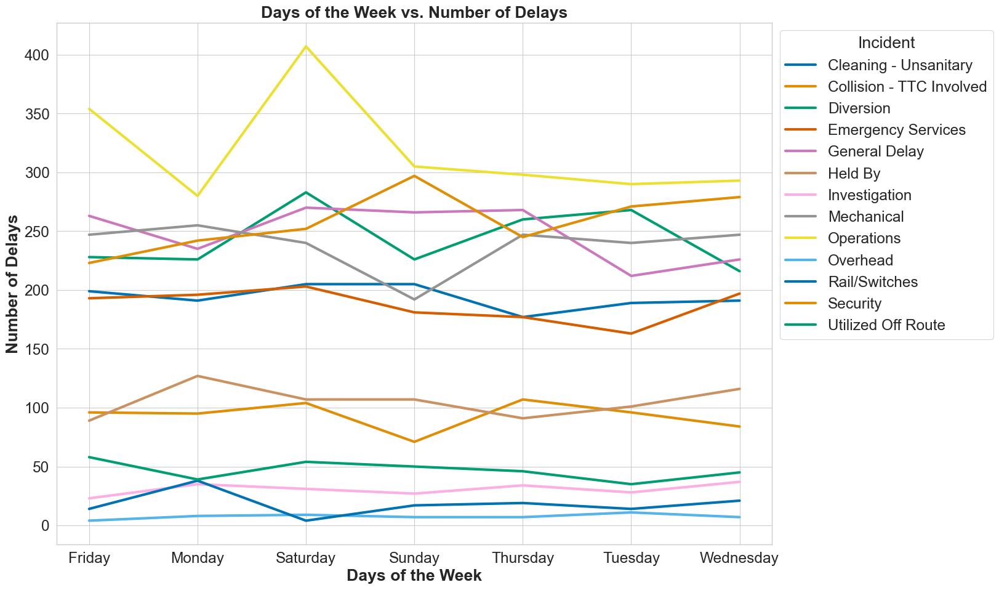

#### Spatial and Operational Insights 

There are 18 streetcar lines operating across Toronto, and it is important to explore their vulnerability to service disruptions. To accomplish this, additional data analyses were conducted to understand which lines experience the most severe operational challenges.

**Chart 6a: Lines With the Highest Average Delays** 

Based on the figure, Lines 303, 508, 310, 301, 305, 507, and 503 experience the longest delays per incident. Among these, Line 303 stands out with an average delay of approximately 48 minutes, followed by Line 508 at around 42 minutes. Lines 310, 301, and 305 also show significantly high average delays. These results indicate that although some of these lines may not encounter disruptions frequently, the delays that do occur tend to be long-lasting and operationally costly, likely due to route-specific constraints or limited opportunities for bypassing blockages.

**Chart 6b: Lines With the Most Delay Incidents** 

When examining the number of delay incidents, Lines 501, 504, 505, 510, 506, and 512 stand out as the most incident-prone routes. Line 501 records the highest number of delays with roughly 2,776 incidents, followed by 504 and 505 with 2,198 and 1,825 incidents, respectively. These lines typically serve dense urban corridors and experience high ridership and traffic interaction, contributing to more frequent operational disruptions. Their vulnerability stems not from delay duration but from the sheer frequency of incidents requiring intervention.

**Chart 6c: Lines With the Most Unpredictable Delays** 

The variability in delay duration reveals another dimension of vulnerability. Lines 508, 303, 310, 511, and 301 exhibit the largest fluctuations, with Line 508 showing an exceptionally high standard deviation of nearly 109 minutes. This unpredictability suggests that delays on these lines are difficult to manage because disruptions can escalate quickly and inconsistently. Such variability is often associated with routes that share significant portions of track with regular traffic, have fewer passing opportunities, or operate through segments prone to sudden congestion or blockages.

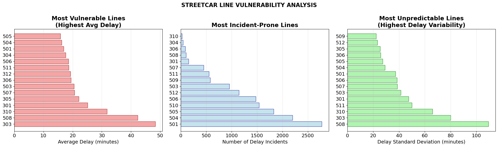

**Chart 7: Severity of Incidents**  

Another important attribute of delay is understanding the pattern of incident types and how they vary in severity. The stacked bar chart illustrates how each incident category contributes to minor, moderate, and major delays across the TTC streetcar network. Severity is classified into three levels: Minor delays lasting less than 10 minutes, Moderate delays lasting 10–25 minutes, and Major delays exceeding 25 minutes.

This visualization highlights that certain incident types such as `Operations`, `Mechanical`, `Diversion`, and `Emergency Services` not only occur frequently but also generate a significant share of moderate and major delays. In contrast, categories like `Rail/Switches`, `Utilized Off Route`, and `Overhead` tend to produce mostly minor delays, indicating they are typically resolved more quickly. The distribution of severity across categories provides valuable insight into which incident types have the greatest operational impact, helping identify where targeted mitigation strategies may reduce overall service disruption.

**Chart 8: Correlation Analysis** 

Before progressing to modelling, a correlation heatmap is generated to explore the relationships among the key attributes, including both numerical variables and encoded categorical fields. This visualization helps identify whether any strong linear associations exist that could influence model performance, introduce redundancy, or highlight meaningful patterns in the delay data.

Overall, the heatmap shows very weak correlations among most variables, indicating that no single attribute strongly predicts delay duration or gap time on its own. The only prominent relationship is the expected high correlation between Min Delay and Min Gap, as both metrics reflect components of the overall disruption duration. A moderate correlation is also visible between `Line` and `Time of Day`, suggesting that certain lines operate more frequently or more heavily during specific hours, but this pattern is not strong enough to dominate model behaviour. Seasonal, daily, and date-related fields show very low correlations with operational attributes such as delays, incidents, or vehicle number, reinforcing the idea that delays are influenced by complex, non-linear, and multi-factor interactions rather than simple linear relationships.

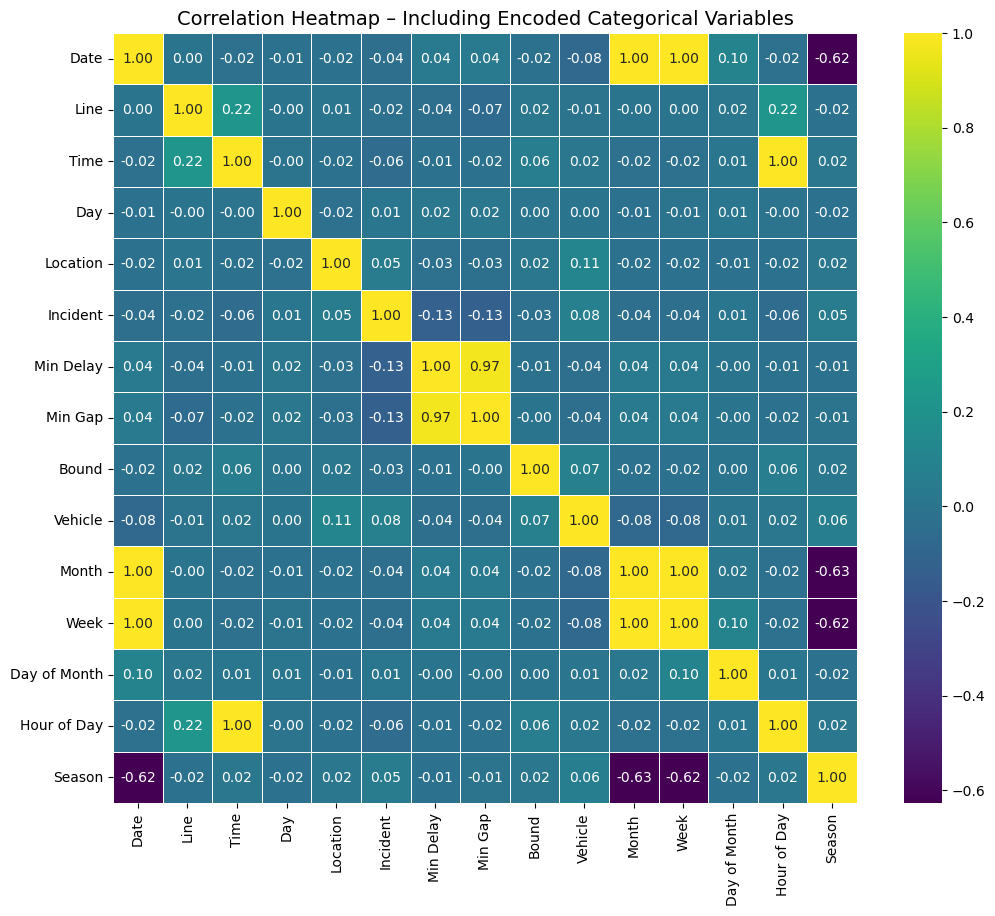

**Chart 9: Temporal Vulnerability Patterns** 

The temporal vulnerability heatmap illustrates how average delay varies across streetcar lines during different times of day. This visualization helps identify when specific lines are most prone to disruption and reveals important time-dependent operational patterns across the network.

A striking observation is that most streetcar lines maintain relatively consistent delay levels across time periods, with moderate increases during high-demand windows such as morning (9–12) and evening (18–21). However, several lines show distinct temporal peaks. Line 508, in particular, exhibits an extreme delay spike during the midday period (12–15), reaching an average delay of approximately 126 minutes, making it the most temporally vulnerable route in the dataset. Lines 303, 310, and 511 also show notable increases during specific periods such as early morning and late night, suggesting sensitivity to operational factors such as reduced service frequency, construction activity, or traffic interactions.

We also noticed longer delays late night and early morning.  The 300 series lines have no delays during the day because they are overnight lines and do not run during the day.

Additionally, heavily used lines like 501, 503, 504, 506, 507, and 512 show elevated midday and afternoon delays, which align with typical traffic congestion and higher passenger volumes during these hours. The pattern indicates that both operational constraints and city-wide traffic dynamics contribute to higher delay durations during middle-of-day periods for several key routes.

**Chart 10a and 10b: Delays By Location** 

We were particularly interested in learning whether certain locations were associated with increased delays.  Of the 1400+ unique locations in our [extra-cleaned database](https://github.com/namathew7/ds6/blob/main/Excel_Files/ttc-streetcar-delay-data-2024_cleaned_extra_CAR.xlsx), only 27 were responsible for more than 100 delays in 2024.  That means, fewer than 2% of the locations hosted nearly a third of delay incidents and a quarter of total delay time.  The TTC could make a large impact with few resources by focusing on these locations.

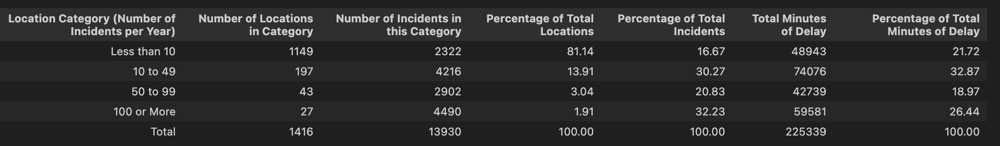

In the bar chart, the x axis shows high incident locations.  The left y axis shows the number of delay incidents per year, color coded by incident type.  Broadview and Spadina stations seem to have numerous sanitation and emergency services delays, while Kingston Loop and Kingston Road Loop  had an alarming number of security delays.  The TTC could minimize delays by coordinating with cleaning and emergency crews at Broadview and Dundas West stations to ensure better access and / or more frequent servicing.  To address the security issues at Kingston Loop and Kingston Road Loop, the TTC may want to partner with local law enforcement.

Union Station remains plagued by a high relative percentage of general delays, but this “insight” will not surprise any Torontonian.

Data on accumulated delay time are overlaid as a line plot.  The location with the highest total delay time in 2024 was King and Church, and we suspect the long delays were the result of diversions.

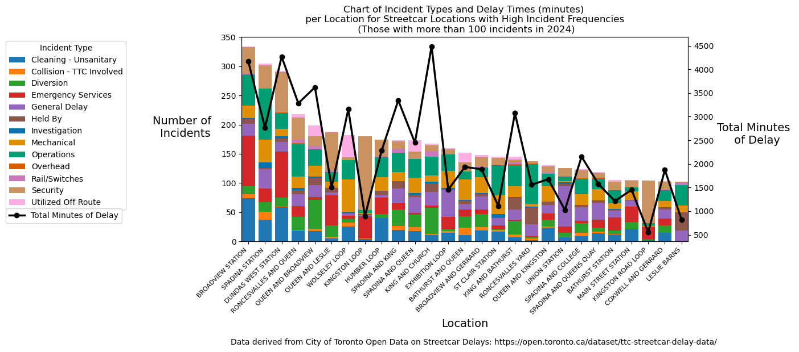

## Regression and Classification Modeling

### Regression Modeling

Our project aims to identify key factors that impact TTC streetcar delay time in minutes, referred to as `Min_Delay`. Early exploratory analysis and visualizations indicated that certain features - such as time of year, location, line, incident type, time of day - were associated with increased delays.

To strengthen our insights, we experimented with various Regression Models, including Linear, KNN, and XGB. These initial models produced high R² scores (>0.90), prompting us to build a pipeline to validate and compare additional algorithms: Linear, Ridge, Lasso, Random Forest, and XGB. These pipeline results were consistent with the initial models. 

However, exploratory visualizations revealed that `Min_Delay` and `Min_Gap` were highly correlated. We suspected that this strong correlation was driving the unusually high R² scores. This correlation is problematic because `Min_Delay` is not a meaningful predictor of 
`Min_Gap`: the time gap between vehicles is a result of the delays. In other words, a streetcar being delayed increases the gap behind it - so the model was essentially "predicting delay using delay".

To test this, we rebuilt the pipeline excluding `Min Gap`. The results showed significantly weaker correlations for most models (<0.08), confirming that `Min_Gap` was the dominant predictor for `Min_Delay`. Taken together, these results show that without `Min_Gap`, the remaining features do not provide sufficient predictive power for Regression Models to accurately estimate Minutes of Delay.

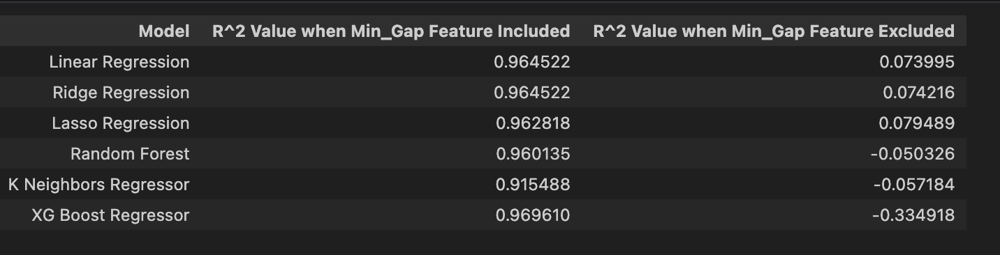

### Classification Modelling 

Since the regression model did not satisfy the goal of predicting minute delay using the features in the ttc dataset, we decided to try classifying the minute delays into two categories: major and minor. We used Environment Canada’s weather data to examine whether temperature and precipitation would be good features to include. We merged the ttc and weather dataframes using month, day and hour as these were the common columns between the two dataframes.

To determine how to classify ‘minor’ versus ‘moderate’ delays, we looked at the descriptive statistics of the original dataset. Delays were classified as minor if they were less than the median (10 min) and moderate if they were between the median and 1.5 IQR + Q3 (10-25 min, inclusive). Not included in our model were ‘0’ values in the Min Delay column (signified no delay) and major (> 25 min) delays. Major delays were greater than 1.5 IQR + Q3 and considered outliers of the dataset. These delays are anomalistic and likely hard to predict or classify accurately. We wanted to use location as a feature for this model, so we also removed any location that appeared fewer than five times in the dataframe. These locations are likely to be typos or rare delay locations.

We used Random Forest classification as it is good at handling noisy and mixed-type data that has many independent variables. The overall model accuracy was 0.82, but the recall (ability to find all actual positives) for minor delays was only 0.57. The precision (proportion of actual positives that were correct) was good for both minor (0.77) and moderate (0.83) classification categories. The features with the greatest importance were hour, temperature, week, day and month. 

If location data was more accurate, it would have likely been a very strong feature in the model. It may be beneficial to create separate classification models for each incident type, as the factors that cause each type of incident likely vary. The threshold we used to separate minor and moderate delays was 10 minutes (median), but the model may produce different results if even slightly different thresholds are used, as 10 is also the mode of the dataset. A different threshold could more reliably differentiate between the two Delay Classes.

### Summary of Regression and Classification Attempts

Several models were explored to estimate `Min Delay`. Delay duration is highly predictable when the ‘Min Gap’ feature is included, with models achieving R² values above 0.96 and average prediction errors of 5–10 minutes, highlighting the strong predictive power of this variable. Table 1 summarizes the performance of each model. However, when ‘Min Gap’ is removed, predictive performance collapses, with R² values falling near zero, indicating that delay time becomes largely unpredictable without this key feature. It is also notable that the performance of classification models improve when including a weather variable, suggesting that environmental factors can provide additional predictive insight. Overall, classification models appear to be more useful for understanding expected delays based on contributing factors.

*Table 1a: Performance results when including `Min Gap`*
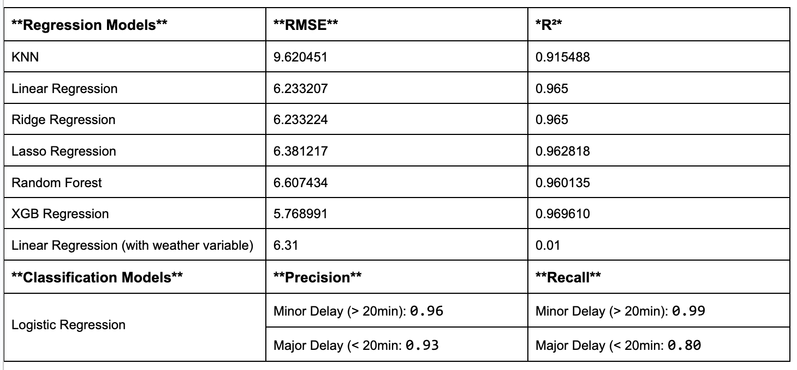

*Table 1b: Performance results when excluding `Min Gap`*
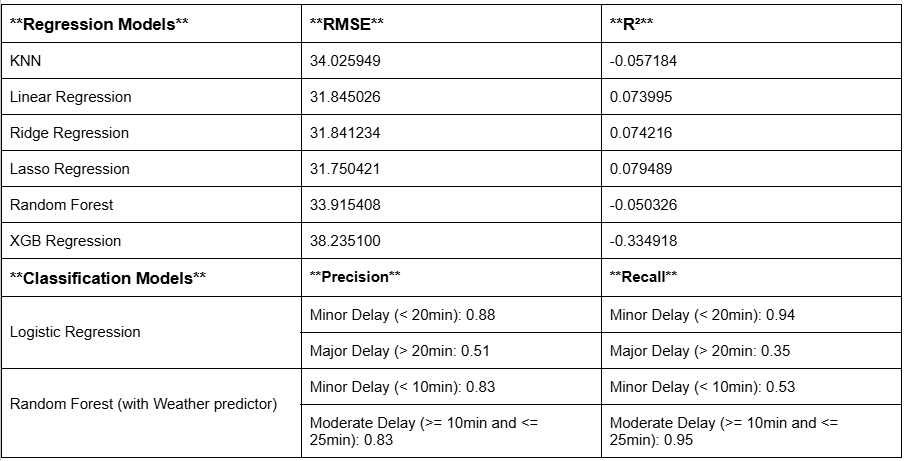

## Conclusions

*Lines and incident types that create the longest delays*

Overall, our analysis shows that Toronto’s streetcar network reveals clear patterns of vulnerability across different routes. While lines such as 303, 508, 310, 301, and 305 experience the longest delays per incident, other busy routes like 501, 504, 505, 510, 506, and 512 are more susceptible to frequent disruptions. Incident severity patterns further highlight that categories such as Operations, Mechanical, Diversion, and Emergency Services contribute disproportionately to moderate and major delays, whereas issues related to Rail/Switches, Utilized Off Route, and Overhead are more often resolved quickly. Together, these findings emphasize the need for targeted mitigation strategies—both for routes with consistently long delays and those with high disruption frequency—to improve the resilience and reliability of the streetcar network.

*Recommendations for TTC operations, staffing, and communications*

To improve the reliability and resilience of the streetcar network, the TTC should adopt a strategy that addresses both the duration and frequency of service disruptions. Lines such as 303, 508, 310, 301, and 305, which experience the longest delays, should be prioritized for operational improvements, including dedicated transit lanes, flexible scheduling, etc. High-frequency incident lines, including 501, 504, 505, 510, 506, and 512, would likely benefit from enhanced monitoring and closer coordination with traffic management to reduce disruption occurrence. Staffing strategies should include deploying additional personnel to these critical lines, creating specialized rapid-response teams for major incidents, and cross-training staff to increase flexibility during disruptions. Additionally, focusing resources on incident types that contribute most to moderate and major delays—namely Operations, Mechanical, Diversion, and Emergency Services—through rapid-response teams or preventative maintenance can further reduce delay times. Collectively, these measures could potentially enable the TTC to enhance service reliability, manage delays more effectively, and provide a better overall experience for riders.

## Limitations

*Possible Coverage & Sampling Errors*

The absence of documentation on how delay events were observed, recorded, or sampled means the dataset may suffer from Coverage Errors and Sampling Bias. Without knowing the sampling frame or selection process, it is unclear whether the dataset captures all delay events or only a subset. As a result, the findings may not fully represent typical TTC streetcar delay patterns across the system.

*Processing Errors and Data-Entry Inconsistencies*

There is evidence of manual data entry - most notably frequent misspellings and formatting inconsistencies in the Location field. This suggests the potential for Processing Errors, such as misclassification or incorrect labeling of locations. These issues required substantial manual cleaning, which itself introduces an additional opportunity for subjective error and data transformation bias.

*Manual Cleaning and Reproducibility Concerns*

Cleaning the Location field required manual interpretation and correction, a process that is time-consuming, prone to human error, not easily reproducible, and difficult to scale.

Additionally, during cleaning, rows with null values in the Bound column were removed. Because the impact of these missing values on the analysis is unknown, their exclusion may influence the final results in ways that cannot be quantified.

*Temporal Limitations of the Dataset*

The analysis relies solely on data from 2024, but it is unclear whether 2024 reflects typical delay patterns or contains anomalies. Future work should compare multiple years to determine whether observed patterns persist over time.

*External Disruptions to Route Operations*

The 501 Queen Streetcar experienced major service disruptions throughout much of 2024, including long-term bus replacements and diversions (as documented by the TTC). It is unclear how these disruptions were recorded in the dataset or whether they were systematically accounted for. This uncertainty may have introduced route-specific bias into delay counts and trend interpretations.

*Inconsistent Location Data and Its Impact on Spatial Analysis*

An in-depth spatial analysis conducted using additional GIS software revealed that the location dataset contains a wide range of entries beyond official TTC streetcar stops, including street names, intersections, landmarks, and inconsistently formatted locations. Because of this variability, it is not possible to reliably match these locations to official stop coordinates through automated processes, necessitating extensive manual review and additional data cleaning steps. For example, a test conducted on Route **501** showed that the official number of stops is **88**, yet the dataset contains **471 unique location entries** associated with this line. Many of these entries do not correspond to the actual route and appear to be erroneous or misreported locations from other parts of the city.
If standardized stop codes were used during the delay recording process, a far more accurate and meaningful spatial analysis could be conducted, enabling precise mapping of delay hotspots and supporting stronger operational insights for network planning.

## Ideas for Future Analyses (things we would have done if we had more time)

Our analyses of the 2024 Streetcar Delay Dataset could be significantly enhanced. If more time were available, here are some avenues we would pursue:
  1)	Clean the “Location” information even more thoroughly.  We also encourage the TTC to automate the way they record locations.
  2)	Create a “Location Mapping” file where the name of each location could be mapped to a station identification number and GPS coordinates.  Again, this data would be really helpful for working with location data and comparing it to external data.
  3)	Perform more background research on different types of regressor models to understand why some may be better candidates for our dataset than others.  The regressor models used in our project were common ones and some recommended by learning support.
  4)	Similarly, we would research and try to understand more methods for encoding categorical data.
  5)	When working with regressors, we could also attempt more strategies to process the data in advance.   We received suggestions that include removing outliers, adding external data, testing different encoding methods (other than One-Hot), and trying regression with binned rather than continuous data.
  6)	We would like to explore the nature of "Overhead" delays.  These types of delays showed up in our data as having some of the longest average delay times.  Chart 2 indicates that the length of "Overhead" delays was likely skewed by a few outliers.  We could investigate the nature of these outliers, and possibly revisit analyses with those data excluded. 
  7)	For both classification and regression, we could try running the models with subsets of data (like by incident type) to examine if the variables affect each type of incident differently.
  8)	We could bring in more external data to use other variables (like special events, work crew schedules, ridership data) to predict or classify minutes delayed.
  9)	Additionally, we could try our analyses with data from additional years.  Stakeholders would benefit from knowing whether the identified trends were specific to 2024, or if they are longstanding issues.  We would also be very curious to see shifts in TTC usage and delays before and after COVID.

## Team Videos
1. [Chloe Li](https://docs.google.com/videos/d/1lk8i2l89XcG3l--vBtuJQp7BWutnXQGW4sY_Xritpxg/edit?usp=sharing)
2. [Christine Romano](https://drive.google.com/file/d/10cNn9PEqbVNoMFNnnTuiHURJxz6Xdtkj/view?usp=sharing)
3. [Natasha Mathew](https://drive.google.com/file/d/1eOikP5jQHNjC3eKNXklBek-qh84V39uW/view?usp=sharing)
4. [Semiha Demirbas Caglayan](https://drive.google.com/file/d/1YcWnNi2xQmsNJvs5g8GGFamC--lB3jgO/view?usp=sharing)
5. [Tanner Ferreira](https://drive.google.com/file/d/1H1v4qq31cax07nQnwEBBvgVh9x35rEhS/view?usp=drive_link)

## Credits and Source
Dataset sourced from [City of Toronto’s Open Data Portal: TTC Streetcar Delay Data](https://open.toronto.ca/dataset/ttc-streetcar-delay-data/) and
[Environment Canada Weather Data Station 6158355](https://climate.weather.gc.ca/historical_data/search_historic_data_e.html)

-----------

